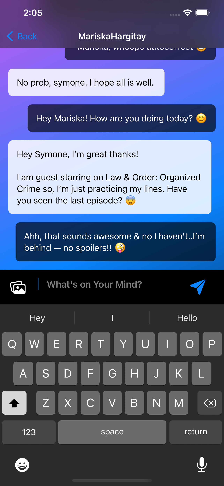

# Stay-Connected-App

## Description
- Stay Connected is a real-time text messaging application built with Swift, SwiftUI and Firebase. 

## UI Preview

## Dependencies
- Stay Connected needs the following technologies to run properly:
- **Google Firebase:**
	- Firebase Auth
	- Firestore Database
	- Firebase Storage

## Setup
- Set up your iOS app for [Firestore](https://firebase.google.com/docs/firestore/quickstart).
- In the Authentication tab of the Firebase console go to the Sign-in Method page and enable 'Email/Password'.
- Run the app on an iOS device.

## Resources
- For more information about Google Firebase [visit](https://firebase.google.com/docs).
